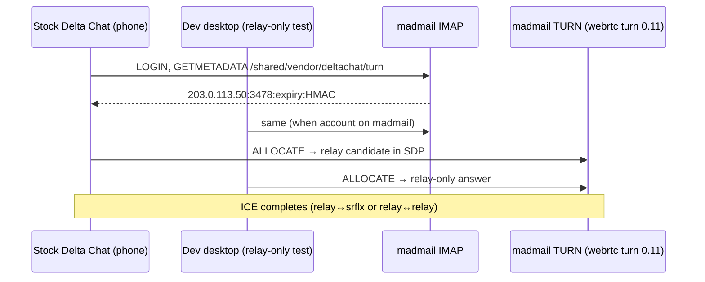

# Delta Chat calls — TURN relay on Chatmail (madmail)

This document explains how **audio/video calls** use TURN on a Chatmail server, how that compares to **nine.testrun.org**, and how to verify **madmail** TURN after deploy.

**Normative specs:** [RFC 8445](RFC/rfc8445.txt) (ICE), [RFC 8656](RFC/rfc8656.txt) (TURN), [RFC 8489](RFC/rfc8489.txt) (STUN), [RFC 5464](RFC/rfc5464.txt) (IMAP METADATA), [TURN REST draft](RFC/draft-uberti-behave-turn-rest-00.txt) (credentials).

**Related:** [11-proxy-services.md](11-proxy-services.md), [03-imap-server.md](03-imap-server.md) (METADATA), [plans/b9/](../plans/b9/README.md), operator runbook [turn-test.md](../../turn-test.md).

**Reference only (not linked from `crates/`):** [`context/chatmail-turn`](../../context/chatmail-turn) (standalone pion/webrtc sidecar), [`context/turn-rs`](../../context/turn-rs) (abandoned embedded path), [`context/cmdeploy`](../../context/cmdeploy), [`context/rtc`](../../context/rtc) / [`context/webrtc`](../../context/webrtc).

---

## End-to-end flow (unchanged contract)



Core and desktop are **out of scope** for madmail server fixes; they consume IMAP metadata and WebRTC policy. This doc focuses on **what madmail must provide** for relay paths.

---

## Production stack (May 2026)

| | **nine.testrun.org** (reference) | **your madmail host** (e.g. `203.0.113.50`) |
|---|----------------------------------|-------------------------------------------|
| TURN engine | **pion/webrtc** [`context/chatmail-turn`](../../context/chatmail-turn) | **webrtc-rs `turn` 0.11** via [`crates/chatmail-turn`](../../crates/chatmail-turn) |
| Process | Standalone `chatmail-turn` + Unix cred socket | Embedded in `madmail` (`turn_boot.rs`) |
| Credentials | Long-term / Unix broker (`north` secret in reference binary) | **TURN REST** — `GETMETADATA` → `host:port:expiry:base64(HMAC-SHA1)` |
| Control plane | UDP `:3478` on each non-loopback NIC | UDP `:3478` (`0.0.0.0` or per-NIC bind) |
| Relay addresses | `RelayAddressGeneratorStatic` — real UDP per allocation | Same pattern: bind locally, advertise `relay_ip` in XOR-RELAYED-ADDRESS |
| Dependencies | `context/` paths | **crates.io only** (`turn`, `webrtc-util`, `netdev`) — no `context/` in `Cargo.toml` |

Madmail intentionally matches the **same TURN implementation family** as nine (webrtc/pion), not the earlier experimental **turn-rs** embed.

### Verified success (relay-only desktop + stock phone)

```text
Selected candidate pair: local: relay (TURN) 203.0.113.50 => remote: srflx (STUN) 198.51.100.20
```

SDP shows relay on **your madmail TURN host** (e.g. `203.0.113.50`), not Core fallback ICE from `nine.testrun.org`.

---

## Why the first madmail attempt failed (historical)

An earlier build used embedded **[`context/turn-rs`](../../context/turn-rs)**. That path diverged from pion/webrtc behaviour:

| Issue | turn-rs (removed) | webrtc `turn` (current) |
|-------|-------------------|-------------------------|
| Relay ports | Virtual / manual `relay_udp` patches | Native per-allocation UDP (`RelayAddressGeneratorStatic`) |
| Permissions | IP/port rules easy to get wrong | Same model as nine — permissions on peer IP, Send/Data via relay |
| STUN on `:3478` | Always works (webrtc turn) | Same |

**Do not** deploy or document turn-rs for madmail calls anymore. `context/turn-rs` remains in the repo for study only.

---

## `crates/chatmail-turn` (shipped)

| Module | Role |
|--------|------|
| [`credentials.rs`](../../crates/chatmail-turn/src/credentials.rs) | TURN REST HMAC + metadata line format |
| [`parse.rs`](../../crates/chatmail-turn/src/parse.rs) | Parse `host:port:user:pass` from METADATA |
| [`runner.rs`](../../crates/chatmail-turn/src/runner.rs) | Spawn `turn::server::Server` + `LongTermAuthHandler` (expiry username + HMAC password) |
| [`turn_client.rs`](../../crates/chatmail-turn/src/turn_client.rs) | Test client on `turn::client::Client` (integration tests only) |

**Spawn behaviour** (`runner.rs`):

- `LongTermAuthHandler::new(turn_secret)` — validates expiry in username, password = `base64(HMAC-SHA1(secret, username))` (aligned with Core / Madmail IMAP).
- Listen: all non-loopback, non-link-local IPs when bind is `0.0.0.0:3478` (same idea as reference `chatmail-turn` `listen_ips()`).
- Relay: `RelayAddressGeneratorStatic { relay_address: relay_ip, address: bind_ip }` — sockets bind on local interface, SDP advertises `turn_relay_ip` / `turn_server`.

**`test_relay_only` / `turn_test_force_relay`:** Sets IMAP key `/shared/vendor/deltachat/turn-test-relay-only` so Core may use `iceTransportPolicy: relay`. The webrtc server **still** answers STUN Binding on `:3478` (pion behaviour). Relay-only testing is enforced on the **desktop** via `DELTACHAT_FORCE_RELAY_ONLY=1` / calls-webapp `relayOnly`, not by rejecting STUN on the server.

---

## Test matrix (your setup)

| Desktop | Phone | Expected |
|---------|-------|----------|
| `DELTACHAT_FORCE_RELAY_ONLY=1` | Stock Delta Chat | **relay ↔ srflx** via your madmail TURN host |
| `DELTACHAT_FORCE_RELAY_ONLY=0` | Stock DC | May use **srflx ↔ srflx** (P2P); TURN optional |
| Relay-only | Relay-only (two dev desktops) | **relay ↔ relay** on same TURN |

**Do not** treat a nine.testrun.org call as proof of madmail TURN unless SDP relay addresses match **your** server's public IP or hostname.

---

## Server configuration (example)

Production-shaped config (replace `203.0.113.50` with your public IP — [RFC 5737](https://datatracker.ietf.org/doc/html/rfc5737) example only):

```text
turn_enable yes
turn_server 203.0.113.50
turn_port 3478
turn_secret <secret>
turn udp://0.0.0.0:3478 tcp://0.0.0.0:3478 {
    realm 203.0.113.50
    secret <same>
    relay_ip 203.0.113.50
}
```

**Normal operation:** `test_force_relay` **off**, no `turn-test.conf` systemd drop-in ([turn-test.md](../../turn-test.md)).

**Firewall:** UDP **3478** and UDP **49152–65535** (or full ephemeral range used by the OS) to the relay IP (VPS + cloud security group).

---

## Deploy and verify

### 1. Build and deploy madmail

```bash
cd /path/to/madmailv2
make push2
```

### 2. Confirm TURN started

```bash
ssh root@YOUR_SERVER 'journalctl -u madmail.service -n 30 --no-pager | grep -i turn'
```

Expect `TURN server started (webrtc turn; …)` and `turn_test_force_relay=false` in normal mode.

### 3. Confirm IMAP metadata (madmail account)

```bash
openssl s_client -connect mail.example.com:993 -quiet 2>/dev/null <<'EOF'
a001 LOGIN "you@example.com" "password"
a002 GETMETADATA "" (/shared/vendor/deltachat/turn)
a003 LOGOUT
EOF
```

Response must include your host's TURN REST line (`host:3478:…`), not only fallback servers.

### 4. Client prep

- Account on **madmail** IMAP (re-add if Core cached fallback ICE for ~7 days).
- Desktop dev relay test: `DELTACHAT_FORCE_RELAY_ONLY=1`; phone stays stock Delta Chat.
- Restart apps after server deploy.

### 5. Call success criteria (calls-webapp DevTools)

- Offer/answer: **TURN relay** on your madmail host (e.g. `203.0.113.50:<port>`)
- Log: `Selected candidate pair: local: relay (TURN) <your-host> => remote: srflx …` (or relay↔relay)
- Audio connects; data channels (trickle ICE, muted state) open

### 6. Regression tests (local, before push)

```bash
cargo test -p chatmail-turn
cargo test -p chatmail-integration --test turn_e2e
```

Optional live server (credentials from env):

```bash
export CHATMAIL_TURN_REMOTE=1
export CHATMAIL_TURN_IMAP_HOST=mail.example.com:993
# … see crates/chatmail-turn/tests/remote_live.rs
cargo test -p chatmail-turn turn_remote_live -- --ignored --nocapture
```

---

## nine.testrun.org reference (cmdeploy)

Production on nine uses:

- [`context/cmdeploy/.../turnserver.service.f`](../../context/cmdeploy/src/cmdeploy/service/turnserver.service.f) — `chatmail-turn` binary
- [`context/cmrelay/.../metadata.rs`](../../context/cmrelay/src/filtermail/src/metadata.rs) — Dovecot dict → Unix socket credentials
- [`context/chatmail-turn`](../../context/chatmail-turn) — webrtc `turn` 0.11, multi-NIC `:3478`, static relay IP

Madmail does **not** run Dovecot; it serves `/shared/vendor/deltachat/turn` from **chatmail-imap** with TURN REST HMAC ([11-proxy-services.md](11-proxy-services.md)). The **wire protocol and relay datapath** are the same family; only credential delivery differs.

---

## Troubleshooting

| Symptom | Cause | Action |
|---------|--------|--------|
| Fallback TURN in SDP (not your host) | Core **fallback** ICE (`nine.testrun.org`) | Re-add madmail account; verify GETMETADATA |
| Relay in SDP but no selected pair | Old **turn-rs** binary, firewall, or stale creds | `make push2`; open UDP 3478 + ephemeral; re-add account |
| `relayOnly` + only your madmail relay in answer | Desktop relay-only OK | Phone must gather relay or srflx; check phone on mobile data |
| srflx ↔ srflx only | Relay-only off or ICE chose P2P | Expected when `DELTACHAT_FORCE_RELAY_ONLY=0` |
| `turn-test-relay-only` but STUN still works | Server does not reject Binding (by design) | Use desktop `relayOnly` / env flag for policy |

---

## Implementation index (in-tree, production)

| Component | Path |
|-----------|------|
| TURN crate | [`crates/chatmail-turn/`](../../crates/chatmail-turn/) |
| TURN boot / discovery | [`crates/chatmail/src/turn_boot.rs`](../../crates/chatmail/src/turn_boot.rs) |
| IMAP METADATA + capabilities | [`crates/chatmail-imap/src/session.rs`](../../crates/chatmail-imap/src/session.rs) |
| Integration tests | [`tests/turn_e2e.rs`](../../tests/turn_e2e.rs) |
| Core ICE (read-only) | [`context/core/src/calls.rs`](../../context/core/src/calls.rs) |
| Operator runbook | [`turn-test.md`](../../turn-test.md) |

---

## Status

| Item | State |
|------|--------|
| IMAP `GETMETADATA` + TURN REST creds | Shipped |
| Embedded TURN = **webrtc `turn` 0.11** (pion-class) | Shipped |
| `crates/chatmail-turn` — no `context/` dependencies | Shipped |
| Relay ↔ srflx on madmail TURN (verified in dev) | **Working** |
| turn-rs embed | **Removed** — reference only under `context/turn-rs` |
| TURNS / `turns:` URLs | Phase 2 ([11-proxy-services.md](11-proxy-services.md)) |

## Related RFCs

Delta Chat calls: IMAP discovery + WebRTC ICE/TURN/STUN. Full STUN/TURN inventory: [`RFC/README.md`](RFC/README.md) (§ STUN / TURN / ICE). Regenerate: [`RFC/download-rfcs.sh`](RFC/download-rfcs.sh).

| RFC / draft | Topic | Local file |
|-------------|-------|------------|
| [5464](https://datatracker.ietf.org/doc/html/rfc5464) | IMAP METADATA `/shared/vendor/deltachat/turn` | [rfc5464.txt](RFC/rfc5464.txt) |
| [draft TURN REST](https://datatracker.ietf.org/doc/html/draft-uberti-behave-turn-rest-00) | Shared-secret credentials | [draft-uberti-behave-turn-rest-00.txt](RFC/draft-uberti-behave-turn-rest-00.txt) |
| [8445](https://datatracker.ietf.org/doc/html/rfc8445) | ICE | [rfc8445.txt](RFC/rfc8445.txt) |
| [8656](https://datatracker.ietf.org/doc/html/rfc8656) | TURN (current) | [rfc8656.txt](RFC/rfc8656.txt) |
| [8489](https://datatracker.ietf.org/doc/html/rfc8489) | STUN (current) | [rfc8489.txt](RFC/rfc8489.txt) |
| [5389](https://datatracker.ietf.org/doc/html/rfc5389) | STUN (obsoleted by 8489) | [rfc5389.txt](RFC/rfc5389.txt) |
| [5769](https://datatracker.ietf.org/doc/html/rfc5769) | STUN test vectors | [rfc5769.txt](RFC/rfc5769.txt) |
| [6062](https://datatracker.ietf.org/doc/html/rfc6062) | TURN TCP relaying (phase 2) | [rfc6062.txt](RFC/rfc6062.txt) |
| [6156](https://datatracker.ietf.org/doc/html/rfc6156) | TURN IPv6 (phase 2) | [rfc6156.txt](RFC/rfc6156.txt) |
| [5766](https://datatracker.ietf.org/doc/html/rfc5766) | TURN (historic; see 8656) | [rfc5766.txt](RFC/rfc5766.txt) |
| [3489](https://datatracker.ietf.org/doc/html/rfc3489) | STUN classic (background) | [rfc3489.txt](RFC/rfc3489.txt) |
| [6263](https://datatracker.ietf.org/doc/html/rfc6263) | ICE bandwidth management | [rfc6263.txt](RFC/rfc6263.txt) |
| [8446](https://datatracker.ietf.org/doc/html/rfc8446) | TLS for TURNS (phase 2) | [rfc8446.txt](RFC/rfc8446.txt) |
