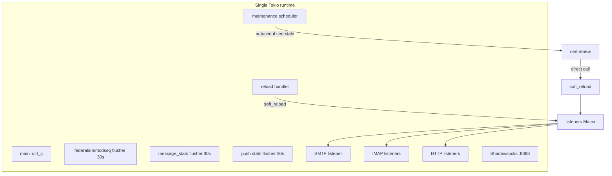

# Problem 002 — Process-wide deadlock / runtime freeze (GitHub #68)

**Status:** Investigated (code review); root cause not yet confirmed on a live frozen instance  
**GitHub:** [themadorg/madmail#68](https://github.com/themadorg/madmail/issues/68)  
**Reported version:** 2.9.0 (`madmail-linux-amd64`)  
**Assignee:** omidz4t  
**Date:** 2026-06-30

## Summary

After several hours of uptime, Madmail V2 stops accepting **all** incoming connections (SMTP, IMAP, HTTP, Shadowsocks, etc.) while the process remains alive. Kernel sockets stay in `LISTEN` with growing backlogs, but the application never calls `accept()`. Every OS thread blocks in `futex_wait` — consistent with a **full Tokio runtime stall** (user-space lock deadlock, failed reload leaving zombie listeners, or worker-thread starvation), not a crash or kernel port-bind failure.

## Reported symptoms (issue #68)

| Observation | Implication |
|-------------|---------------|
| `systemctl status` → `active (running)` | Process not killed by OOM or signal |
| CPU → 0% | Scheduler not running useful work |
| `ss -tlnp` → ports LISTEN, backlog grows (e.g. 28 on :993) | Kernel accepts TCP; userspace event loop frozen |
| `strace -p <pid> -f` → no syscalls on connect | Tasks blocked on locks/condvars, not I/O poll |
| All 7 threads → `futex_wait_queue` in `/proc/<pid>/task/*/stack` | Entire thread pool parked on mutex/futex |
| Uptime ~13 h before freeze | Intermittent; correlate with reload logs / load |

**Environment (reporter):** Debian 13 (Trixie), kernel `6.12.94+deb13-amd64`, x86_64.

## Architecture context

Madmail `run` boots a **single Tokio multi-thread runtime** (`rt-multi-thread` in [`Cargo.toml`](../../../Cargo.toml) workspace `tokio` dependency). Protocol listeners are **tasks on that shared runtime**, not one OS thread per port.

| Component | File | Key symbols / lines |
|-----------|------|---------------------|
| Binary entry | [`crates/chatmail/src/main.rs`](../../../crates/chatmail/src/main.rs) | `#[tokio::main]` L22–37 |
| Boot / hold supervisor | [`crates/chatmail/src/boot.rs`](../../../crates/chatmail/src/boot.rs) | `boot::run()` L80–141; `start_servers` L116–124 |
| Server wiring | [`crates/chatmail/src/servers.rs`](../../../crates/chatmail/src/servers.rs) | `start_servers` L32–39; `build_http_extra` L43–63 |
| Listener supervisor | [`crates/chatmail/src/supervisor.rs`](../../../crates/chatmail/src/supervisor.rs) | `ServerSupervisor` L105–803; `SupervisorInner` L84–102 |
| SMTP accept loop | [`crates/chatmail-smtp/src/server.rs`](../../../crates/chatmail-smtp/src/server.rs) | `run_smtp_listener` L31–89 |
| IMAP accept loop | [`crates/chatmail-imap/src/server.rs`](../../../crates/chatmail-imap/src/server.rs) | `run_imap_listener` L32–90 |
| HTTP accept loop | [`crates/chatmail-fed/src/server.rs`](../../../crates/chatmail-fed/src/server.rs) | `run_http_listener` L47–111 |
| Shadowsocks (:8388) | [`crates/chatmail-shadowsocks/src/server.rs`](../../../crates/chatmail-shadowsocks/src/server.rs) | `spawn_shadowsocks_server` L57–133; accept L100–124 |
| Openmetrics (optional) | [`crates/chatmail-metrics/src/server.rs`](../../../crates/chatmail-metrics/src/server.rs) | `run_openmetrics_listener` L54–73 |
| Shared app state | [`crates/chatmail-state/src/lib.rs`](../../../crates/chatmail-state/src/lib.rs) | `AppState` L54–175 |
| Maintenance scheduler | [`crates/chatmail-tasks/src/scheduler.rs`](../../../crates/chatmail-tasks/src/scheduler.rs) | `spawn_maintenance_scheduler` L54–158 |
| Maintenance intervals | [`crates/chatmail-tasks/src/config.rs`](../../../crates/chatmail-tasks/src/config.rs) | `PERIODIC_INTERVAL` L27; `CERT_RENEWAL_INTERVAL` L33 |

Each SMTP/IMAP/Shadowsocks listener uses `tokio::select!` between `cancel.cancelled()` and `listener.accept()`. Plain HTTP (no TLS) uses `axum::serve` + `graceful_shutdown` instead ([`crates/chatmail-fed/src/server.rs`](../../../crates/chatmail-fed/src/server.rs) L72–76). TLS HTTP (:443) uses a manual accept loop (L79–110).

If **all worker threads** block on locks, every listener stops polling `accept()` simultaneously — matching the issue's `ss` output (including :25, :143, :443, :8388).

The reporter's process had **7 OS threads** (`Tasks: 7`). On a small VPS this is plausibly the default Tokio worker count (~num_cpus) plus minimal extra threads. All threads in `futex_wait` ⇒ **complete runtime paralysis**.



## Top suspects (ranked)

### 1. Failed `soft_reload()` after 8 s join timeout — **highest suspicion (code-proven path)**

| Step | File | Lines | What happens |
|------|------|-------|--------------|
| Stop all listeners | [`crates/chatmail/src/supervisor.rs`](../../../crates/chatmail/src/supervisor.rs) | L521–544 | `listeners.lock().take()`; cancel; `timeout(8s, join.await)` |
| Start listeners (preflight) | same | L319–378, L727–735 | `preflight_listen_addrs` — test-bind each port |
| Set active listeners | same | L461–473 | `*listeners.lock() = Some(...)` only on success |
| Reload error handling | same | L251–254 | Logs `supervisor reload failed`; **no recovery** |

**Failure scenario (no concurrent reload required):**

1. Admin/cert/proxy triggers `soft_reload()` ([`crates/chatmail/src/supervisor.rs`](../../../crates/chatmail/src/supervisor.rs) L547–563).
2. `stop_listeners()` cancels tasks; join waits **at most 8 s** (L534–544).
3. Listener tasks still alive (plain HTTP `graceful_shutdown` with open WebSockets — [`crates/chatmail-fed/src/server.rs`](../../../crates/chatmail-fed/src/server.rs) L72–76; [`crates/chatmail-www/src/webimap_ws.rs`](../../../crates/chatmail-www/src/webimap_ws.rs) L69–176).
4. `start_listeners()` → `preflight_listen_addrs` fails (port still held) (L365–378, L727–735).
5. `listeners` stays `None`; old tasks may still own kernel `LISTEN` fds but never `accept()` → matches growing backlogs.

---

### 2. Cert renewal always calls `soft_reload()` (even on ACME failure) — **high (bug) / low (13 h timing)**

| Step | File | Lines |
|------|------|-------|
| Renewal entry | [`crates/chatmail/src/supervisor/cert_renew.rs`](../../../crates/chatmail/src/supervisor/cert_renew.rs) | `renew_autocert_certificate` L53–91 |
| Skip if cert valid | same | L61–64 (`cert_needs_renewal`) |
| Stop plain HTTP only | same | `stop_http_plain_listener` L94–103 |
| ACME obtain | [`crates/chatmail-acme/src/obtain.rs`](../../../crates/chatmail-acme/src/obtain.rs) | `obtain_certificate` L80+ |
| **Always soft_reload before checking ACME result** | [`crates/chatmail/src/supervisor/cert_renew.rs`](../../../crates/chatmail/src/supervisor/cert_renew.rs) | L85–87 |
| Cert stale check helper | [`crates/chatmail-acme/src/obtain.rs`](../../../crates/chatmail-acme/src/obtain.rs) | `cert_needs_renewal` L203–212 |
| IP cert renew window | [`crates/chatmail-acme/src/obtain_ip.rs`](../../../crates/chatmail-acme/src/obtain_ip.rs) | `IP_CERT_RENEW_WITHIN_DAYS` L39 |

```rust
// crates/chatmail/src/supervisor/cert_renew.rs L85–87
let renew_result = obtain_certificate(&opts).await;
self.soft_reload().await?;   // runs even if obtain_certificate failed
renew_result?;
```

**Timing note:** Maintenance ticks cert every 24 h ([`crates/chatmail-tasks/src/config.rs`](../../../crates/chatmail-tasks/src/config.rs) L33; scheduler L79–90, L128–153), but renewal + `soft_reload` only run when `cert_needs_renewal` is true. A freeze at **~13 h** is a weak match for the first scheduled tick unless the cert was already near expiry (IP certs: &lt;4 days left — [`obtain_ip.rs`](../../../crates/chatmail-acme/src/obtain_ip.rs) L38–39).

---

### 3. Unserialized concurrent `soft_reload()` — **medium (bug)**

Admin reload uses a **single-slot** channel ([`crates/chatmail/src/supervisor.rs`](../../../crates/chatmail/src/supervisor.rs) L127). Cert renewal **bypasses** it.

| Path | File | Lines | Serialized? |
|------|------|-------|-------------|
| Reload handler (admin / CLI) | [`crates/chatmail/src/supervisor.rs`](../../../crates/chatmail/src/supervisor.rs) | L245–276 | Yes (one handler task) |
| Admin queue API | [`crates/chatmail-admin/src/resources/toggles.rs`](../../../crates/chatmail-admin/src/resources/toggles.rs) | `queue_reload` L86–116 |
| `POST /admin/reload` | [`crates/chatmail-admin/src/resources/status_storage.rs`](../../../crates/chatmail-admin/src/resources/status_storage.rs) | `reload` L592–626 |
| Route table | [`crates/chatmail-admin/src/resources/mod.rs`](../../../crates/chatmail-admin/src/resources/mod.rs) | L48 |
| Reload types | [`crates/chatmail-state/src/reload.rs`](../../../crates/chatmail-state/src/reload.rs) | `ReloadRequest` L17–21 |
| Autocert maintenance | [`crates/chatmail/src/supervisor/cert_renew.rs`](../../../crates/chatmail/src/supervisor/cert_renew.rs) | L86 direct `soft_reload()` | **No** |

**`soft_reload()` sequence** ([`crates/chatmail/src/supervisor.rs`](../../../crates/chatmail/src/supervisor.rs) L547–563):

1. `stop_listeners()` L521–544
2. `reload_turn()` L656–671 · `reload_iroh()` L682–704 · `reload_push()` L675–678 · `reload_ss()` L707–723
3. `app.hydrate()` — [`crates/chatmail-state/src/lib.rs`](../../../crates/chatmail-state/src/lib.rs) L153–165
4. `rebuild_http_routers()` L641–652
5. `start_listeners()` L319–475 · `start_openmetrics()` L478–518

**Mutex held during join (up to 8 s):**

- [`crates/chatmail/src/supervisor/cert_renew.rs`](../../../crates/chatmail/src/supervisor/cert_renew.rs) `stop_http_plain_listener` L94–103
- [`crates/chatmail/src/supervisor.rs`](../../../crates/chatmail/src/supervisor.rs) `restart_http_listeners` L609–637

**Note:** `stop_listeners()` does **not** hold `listeners` mutex during join — lock is released after `take()` (L522–523).

---

### 4. What triggers `soft_reload()` in production

| Trigger | Auto? | File | Lines |
|---------|-------|------|-------|
| `POST /admin/reload` (`scope: full`) | Manual | [`crates/chatmail-admin/src/resources/status_storage.rs`](../../../crates/chatmail-admin/src/resources/status_storage.rs) | L592–626 |
| Shadowsocks proxy setting POST | **Auto** | [`crates/chatmail-admin/src/resources/proxy.rs`](../../../crates/chatmail-admin/src/resources/proxy.rs) | L164–165 |
| `madmail reload` CLI | Manual | [`crates/chatmail/src/ctl/reload.rs`](../../../crates/chatmail/src/ctl/reload.rs) | L33 |
| Autocert renewal (cert stale) | **Auto** | [`crates/chatmail/src/supervisor/cert_renew.rs`](../../../crates/chatmail/src/supervisor/cert_renew.rs) | L86 |
| TURN / Iroh / push toggles | **No** — `restart_required` only | [`crates/chatmail-admin/src/resources/toggles.rs`](../../../crates/chatmail-admin/src/resources/toggles.rs) | L61–72, L174–212 |
| Admin-web path change | HttpRoutes only (not full) | [`crates/chatmail-admin/src/resources/settings.rs`](../../../crates/chatmail-admin/src/resources/settings.rs) | L610–611, L619–620 |

---

### 5. `std::sync` locks on Tokio worker threads — **medium suspicion**

| File | Lines | Lock | Hot path |
|------|-------|------|----------|
| [`crates/chatmail-state/src/policy.rs`](../../../crates/chatmail-state/src/policy.rs) | L46–48 | `RwLock` | Federation delivery (sync) |
| [`crates/chatmail-state/src/auth.rs`](../../../crates/chatmail-state/src/auth.rs) | L36, L114–115 | `RwLock` | `jit_registration_enabled()` |
| [`crates/chatmail-state/src/silent_dismiss.rs`](../../../crates/chatmail-state/src/silent_dismiss.rs) | L19+ | `RwLock` | Federation dismiss cache |
| [`crates/chatmail-state/src/listener_ports.rs`](../../../crates/chatmail-state/src/listener_ports.rs) | L41, L64–65 | `RwLock` | Admin status ports |
| [`crates/chatmail-admin/src/auth.rs`](../../../crates/chatmail-admin/src/auth.rs) | L28, L69–82 | `Mutex` | Admin bearer auth — called from [`handler.rs`](../../../crates/chatmail-admin/src/handler.rs) L86 |
| [`crates/chatmail-imap/src/connection_stats.rs`](../../../crates/chatmail-imap/src/connection_stats.rs) | L25–27, L36–57 | `Mutex` | IMAP `on_open` / `on_close` — [`server.rs`](../../../crates/chatmail-imap/src/server.rs) L69, L82 |
| [`crates/chatmail-www/src/router.rs`](../../../crates/chatmail-www/src/router.rs) | L49, L104–110 | `RwLock` | Embedded asset cache |
| [`crates/chatmail-acme/src/http01.rs`](../../../crates/chatmail-acme/src/http01.rs) | L30, L69, L130 | `parking_lot::RwLock` | ACME HTTP-01 hyper `Service` |

Bcrypt / login storm mitigation documented in [`crates/chatmail-state/src/auth.rs`](../../../crates/chatmail-state/src/auth.rs) L31–34. Legacy password verify uses `spawn_blocking` in [`crates/chatmail-auth/src/jit.rs`](../../../crates/chatmail-auth/src/jit.rs) L89.

---

### 6. Long-held `tokio::sync::Mutex` — **medium suspicion (per-mailbox / reload)**

| File | Lines | Behavior |
|------|-------|----------|
| [`crates/chatmail-storage/src/uidlist.rs`](../../../crates/chatmail-storage/src/uidlist.rs) | L100–125, L257–258 | Per-mailbox lock across full `readdir` + index rewrite |
| [`crates/chatmail-storage/src/maildir_message.rs`](../../../crates/chatmail-storage/src/maildir_message.rs) | L100–120 | `list_mailbox_messages` → `uidlist().sync()` |
| [`crates/chatmail-auth/src/jit.rs`](../../../crates/chatmail-auth/src/jit.rs) | L129–158 | `jit_flight` lock across DB + maildir + `spawn_blocking` |
| [`crates/chatmail-state/src/lib.rs`](../../../crates/chatmail-state/src/lib.rs) | L69, L123–127 | `jit_flights` DashMap of per-user mutexes |
| [`crates/chatmail/src/supervisor.rs`](../../../crates/chatmail/src/supervisor.rs) | L691–693 | `iroh_relay.lock()` held across `shutdown().await` |
| [`crates/chatmail-iroh/src/runner.rs`](../../../crates/chatmail-iroh/src/runner.rs) | L165–170 | `IrohRelayHandle::shutdown` — `child.wait().await` |
| [`crates/chatmail-www/src/webimap_ws.rs`](../../../crates/chatmail-www/src/webimap_ws.rs) | L54–66, L78–79 | Shared `Arc<Mutex<WsSink>>` for command + push tasks |

Unlikely to freeze **all** ports alone unless combined with worker exhaustion or a failed reload.

---

### 7. SQLite / periodic flush — **lower suspicion for infinite hang**

| File | Lines | Detail |
|------|-------|--------|
| [`crates/chatmail-db/src/pool.rs`](../../../crates/chatmail-db/src/pool.rs) | L173–188 | WAL, 64 connections, `busy_timeout = 30000` |
| [`crates/chatmail-state/src/flusher.rs`](../../../crates/chatmail-state/src/flusher.rs) | L42–77 | Federation stats + modseq flush every 30 s |
| [`crates/chatmail-db/src/message_stats.rs`](../../../crates/chatmail-db/src/message_stats.rs) | L77–88 | Message counters flush every 30 s |
| [`crates/chatmail-push/src/stats.rs`](../../../crates/chatmail-push/src/stats.rs) | L39–51 | Push stats flush every 30 s |
| [`crates/chatmail/src/boot.rs`](../../../crates/chatmail/src/boot.rs) | L103 | `app_state.start_flusher()` |

---

### 8. Periodic background work (does **not** call `soft_reload`)

| Task | Interval | File | Lines |
|------|----------|------|-------|
| Maintenance prune | 1 h | [`crates/chatmail-tasks/src/scheduler.rs`](../../../crates/chatmail-tasks/src/scheduler.rs) | L95–117 |
| Auto-purge seen | 15 s | same | L119–126; job in [`crates/chatmail-tasks/src/jobs.rs`](../../../crates/chatmail-tasks/src/jobs.rs) L163–171 |
| Purge implementation | — | [`crates/chatmail-storage/src/purge.rs`](../../../crates/chatmail-storage/src/purge.rs) | `purge_read_messages` L64–66 |
| Outbound queue worker | continuous | [`crates/chatmail-delivery/src/queue/worker.rs`](../../../crates/chatmail-delivery/src/queue/worker.rs) | `run_worker` L158–170 |
| Push notify chains | per event | [`crates/chatmail-push/src/notifier.rs`](../../../crates/chatmail-push/src/notifier.rs) | `notify_loop` L147–207 |
| IMAP IDLE | per session | [`crates/chatmail-imap/src/session.rs`](../../../crates/chatmail-imap/src/session.rs) | `handle_idle` L829+; `IDLE_EMIT_TIMEOUT` L45–48 |

No static global lock cycle found in these paths during review.

---

## What is probably *not* the main cause

| Component | Why | Reference |
|-----------|-----|-----------|
| Single-protocol listener bug | Would not freeze all ports together | Listener files above |
| `block_on` in server | CLI e2e only | [`tests/ctl_cli_e2e.rs`](../../../tests/ctl_cli_e2e.rs) |
| Outbound queue deadlock | Semaphore + per-job spawn | [`crates/chatmail-delivery/src/queue/worker.rs`](../../../crates/chatmail-delivery/src/queue/worker.rs) |
| IMAP IDLE hang | 120 s write timeout, drops connection | [`crates/chatmail-imap/src/session.rs`](../../../crates/chatmail-imap/src/session.rs) L45–48, L892–915 |
| OOM / crash | ~43 MiB RSS; process `active` | Issue #68 |
| Kernel / firewall | `LISTEN` + growing backlog | Issue #68 |

---

## Confidence summary (after full code review)

| Hypothesis | Confidence | Key files |
|------------|------------|-----------|
| Failed `soft_reload()` (8 s timeout → bind fail → no recovery) | **Medium–high** | [`supervisor.rs`](../../../crates/chatmail/src/supervisor.rs) L521–544, L365–378, L251–254 |
| Cert renewal runs `soft_reload` even if ACME fails | **High** (bug) | [`cert_renew.rs`](../../../crates/chatmail/src/supervisor/cert_renew.rs) L85–87 |
| Concurrent `soft_reload()` (cert + admin) | **Medium** (bug) | [`cert_renew.rs`](../../../crates/chatmail/src/supervisor/cert_renew.rs) L86; [`supervisor.rs`](../../../crates/chatmail/src/supervisor.rs) L245–276 |
| Full runtime lock deadlock (no reload) | **Medium** | Needs `gdb` backtrace |
| Autocert caused freeze at exactly 13 h | **Low** | [`scheduler.rs`](../../../crates/chatmail-tasks/src/scheduler.rs); [`config.rs`](../../../crates/chatmail-tasks/src/config.rs) L33 |
| SQLite / maintenance alone | **Low** | [`pool.rs`](../../../crates/chatmail-db/src/pool.rs); [`purge.rs`](../../../crates/chatmail-storage/src/purge.rs) |

---

## Diagnostic checklist (for reporter / on-call)

Run when the process is **frozen** (most valuable first):

```bash
PID=<madmail-pid>

# 1. Rust/thread backtraces (identifies which lock)
gdb -p "$PID" -batch -ex "thread apply all bt"

# 2. Confirm all threads on futex
find /proc/$PID/task/ -maxdepth 1 -type d | while read -r t; do
  [ "$t" != "/proc/$PID/task/" ] && echo "--- ${t##*/} ---" && cat "$t/stack"
done

# 3. Listen backlogs (accept not running)
sudo ss -tlnp | grep madmail

# 4. Config correlates
grep -E 'tls_mode|autocert|mail_fsync|retention' /etc/maddy/maddy.conf 2>/dev/null || true

# 5. Reload / cert / errors in journal
journalctl -u madmail --since "24 hours ago" | grep -iE 'reload|renew|supervisor|cannot listen|error'
```

**Questions for reporter:**

1. Is `tls_mode = autocert`? Cert path: [`cert_renew.rs`](../../../crates/chatmail/src/supervisor/cert_renew.rs) L54–55.
2. Any `POST /admin/reload` or Shadowsocks proxy POST? See trigger table above.
3. SQLite or PostgreSQL? [`crates/chatmail-db/src/pool.rs`](../../../crates/chatmail-db/src/pool.rs).
4. Maildir filesystem (local ext4 vs NFS)?
5. `nproc` — reporter had 7 threads total.

**Workaround:** `systemctl restart madmail`.

---

## Recommended fix directions (not implemented)

1. **Serialize all reload paths** — route cert renewal through `reload_tx` ([`supervisor.rs`](../../../crates/chatmail/src/supervisor.rs) L127) or a global `ReloadGuard`.
2. **Do not `soft_reload` on failed ACME** — reorder [`cert_renew.rs`](../../../crates/chatmail/src/supervisor/cert_renew.rs) L85–87.
3. **Listener generation counter** — invalidate stale tasks after `stop_listeners`.
4. **Drop `listeners` mutex before `join.await`** — fix [`cert_renew.rs`](../../../crates/chatmail/src/supervisor/cert_renew.rs) L94–103 and [`supervisor.rs`](../../../crates/chatmail/src/supervisor.rs) L609–637.
5. **Recovery on failed `start_listeners`** — retry or fatal exit instead of silent broken state (L251–254).
6. **Stall probe** — openmetrics gauge for time since last `accept` ([`crates/chatmail-metrics/src/server.rs`](../../../crates/chatmail-metrics/src/server.rs)).

---

## Test plan

Goal: **reproduce the freeze deterministically**, then prove each recommended fix removes it. Because the live symptom is "all ports stop accepting while the process stays alive", every test asserts the same invariant after a reload/renew cycle: **a fresh TCP connect to each listener still completes**.

### Shared invariant / assertion helper

For any listener address `a`, "still serving" = `TcpStream::connect(a)` succeeds within a short deadline **and** a protocol probe returns (SMTP `220`, IMAP `* OK`, HTTP `200/404`). "Frozen" = connect succeeds (kernel `LISTEN`) but no banner/response before timeout — this is exactly issue #68 and must be distinguished from a clean port close (connect refused).

```text
serving(a)  := connect(a) ok  AND  banner/response before T_probe
frozen(a)   := connect(a) ok  AND  no response before T_probe   ← FAIL (regression)
closed(a)   := connect(a) refused                                ← reload lost the listener (FAIL)
```

### Layer 1 — in-crate unit / reload tests (`crates/chatmail/src/supervisor.rs`, new `#[cfg(test)] mod tests`)

Fast, no real ACME. Drives `SupervisorInner` directly (add `pub(crate)` test hooks or a `#[cfg(test)]` constructor). Uses ephemeral ports via `TcpListener::bind("127.0.0.1:0")`.

| # | Test | Setup | Assert | Covers |
|---|------|-------|--------|--------|
| U1 | `soft_reload_is_idempotent` | Start supervisor on ephemeral ports; run `soft_reload()` 5× | every listener `serving` after each cycle; `listeners` is `Some` | baseline |
| U2 | `reload_survives_open_websocket` | Open a WebIMAP WS to plain HTTP, hold it, then `soft_reload()` | reload returns within join timeout; HTTP `serving` afterward; **not** `frozen`/`closed` | Suspect #1 |
| U3 | `preflight_conflict_recovers` | Externally occupy one listener port, `soft_reload()` | reload `Err`; **other** listeners still `serving` (no all-port loss); after port freed, next reload restores all | Suspect #1, fix #5 |
| U4 | `cert_renew_failure_does_not_reload` | Inject an `obtain_certificate` that returns `Err` | `soft_reload` **not** called on ACME failure (spy/counter); listeners untouched | Suspect #2, fix #2 |
| U5 | `concurrent_reload_is_serialized` | Fire admin `reload_tx` and cert-renew `soft_reload()` concurrently | both complete; no deadlock within deadline; final state `serving` | Suspect #3, fix #1 |
| U6 | `stop_listeners_releases_mutex_before_join` | Slow-to-join listener; from another task try `listeners.lock()` during the join window | lock acquired before join completes (proves no hold-across-await) | Suspect #3, fix #4 |

> U4/U5 require making the cert-renew path injectable (trait already exists: `CertificateRenewer`) and, for U5, routing renewal through `reload_tx` — i.e. the tests double as the acceptance criteria for fixes #1 and #2.

### Layer 2 — process e2e (`tests/reload_freeze_e2e.rs`, new; mirror `tests/openmetrics_e2e.rs` + `boot_test.rs`)

Boots the real `madmail` binary on ephemeral ports against a `TempDir` state dir.

| # | Test | Action | Assert | Covers |
|---|------|--------|--------|--------|
| E1 | `admin_reload_keeps_all_ports_serving` | `POST /admin/reload {scope:"full"}` 20× in a loop | after each: SMTP/IMAP/HTTP all `serving` | Suspects #1/#3 |
| E2 | `reload_under_load` | Drive continuous SMTP submit + IMAP IDLE while looping reloads | no `frozen` port; backlog (`ss -tln`) does not grow monotonically | Suspects #1/#5/#6 |
| E3 | `shadowsocks_proxy_post_reload` | `POST` shadowsocks proxy setting (auto-triggers `soft_reload`) | :8388 and all mail ports `serving` after | trigger table row |
| E4 | `cli_reload_loop` | `madmail reload` CLI N× | all ports `serving`; process still `active` | Suspect #3 |

### Layer 3 — ACME / cert-renew e2e (mock ACME, e.g. Pebble or a stub `obtain_certificate`)

| # | Test | Action | Assert | Covers |
|---|------|--------|--------|--------|
| A1 | `renew_success_reloads_once` | `tls_mode=autocert`, cert near expiry, mock ACME success | one reload; :443 serves new cert; port 80 restored | Suspect #2 |
| A2 | `renew_acme_failure_no_reload` | mock ACME returns error | listeners never dropped; `renew_if_needed` returns `Err`; ports `serving` throughout | Suspect #2, fix #2 |
| A3 | `renew_during_admin_reload` | trigger renewal while an admin full reload is in flight | serialized (fix #1); no freeze; single final `serving` state | Suspect #3 |

### Layer 4 — soak / system (Python harness `tests/cmlxc`, `relay_minitest`)

Long-running, closest to the reporter's 13 h freeze. Run in a container matching the report (Debian 13, ~2 vCPU so Tokio worker count ≈ reporter's 7 threads).

- **S1 — reload soak:** loop full reload every 30 s for ≥2 h under trickle traffic; watchdog probes all ports every 10 s and fails on first `frozen`/`closed`. Capture `gdb -p <pid> -batch -ex "thread apply all bt"` on failure (see Diagnostic checklist).
- **S2 — autocert clock-warp:** set cert expiry so `cert_needs_renewal` fires early; combine with mock/staging ACME failures to force the Suspect #2 path repeatedly; assert never-frozen.
- **S3 — worker starvation probe:** pin worker threads low (`TOKIO_WORKER_THREADS=2`) and hammer bcrypt/JIT + maildir list to stress the `std::sync` / long-`tokio::sync::Mutex` paths (Suspects #5/#6); watchdog as in S1.

### Layer 5 — observability regression (fix #6)

- **O1:** add an openmetrics gauge `madmail_seconds_since_last_accept{listener=…}` and assert in E2/S1 that it stays below a threshold; a rising gauge is the machine-checkable definition of the freeze and guards against regressions that unit tests miss.

### Pass / fail criteria

- **Reproduction gate (pre-fix):** at least one of U2/U3/A2/S1 must reproduce `frozen` or `closed` on the current tree; otherwise the hypothesis is not yet code-confirmed (matches this doc's "root cause not yet confirmed" status).
- **Fix gate:** all Layer 1–3 tests green; S1 completes ≥2 h with zero `frozen`/`closed`; O1 gauge bounded.

### Coverage matrix (suspect / fix → tests)

| Suspect / Fix | Tests |
|---------------|-------|
| #1 failed `soft_reload` (join timeout → bind fail → no recovery) / fix #3, #5 | U2, U3, E1, E2, S1 |
| #2 reload on ACME failure / fix #2 | U4, A1, A2, S2 |
| #3 concurrent/unserialized reload / fix #1 | U5, E1, E4, A3 |
| #4 mutex held across `join.await` / fix #4 | U6, E2 |
| #5 `std::sync` on worker threads | S3, E2 |
| #6 long `tokio::sync::Mutex` | S3, E2 |
| Observability / fix #6 | O1, E2, S1 |

---

## Code reference index (all cited paths)

| Area | Path |
|------|------|
| **Runtime / boot** | |
| Binary entry | [`crates/chatmail/src/main.rs`](../../../crates/chatmail/src/main.rs) |
| Boot | [`crates/chatmail/src/boot.rs`](../../../crates/chatmail/src/boot.rs) |
| Server wiring | [`crates/chatmail/src/servers.rs`](../../../crates/chatmail/src/servers.rs) |
| Workspace Tokio features | [`Cargo.toml`](../../../Cargo.toml) |
| **Supervisor / reload** | |
| Supervisor | [`crates/chatmail/src/supervisor.rs`](../../../crates/chatmail/src/supervisor.rs) |
| Autocert renewal | [`crates/chatmail/src/supervisor/cert_renew.rs`](../../../crates/chatmail/src/supervisor/cert_renew.rs) |
| Reload CLI | [`crates/chatmail/src/ctl/reload.rs`](../../../crates/chatmail/src/ctl/reload.rs) |
| Reload request HTTP | [`crates/chatmail/src/ctl/request_reload.rs`](../../../crates/chatmail/src/ctl/request_reload.rs) |
| Reload types | [`crates/chatmail-state/src/reload.rs`](../../../crates/chatmail-state/src/reload.rs) |
| **Protocol listeners** | |
| SMTP | [`crates/chatmail-smtp/src/server.rs`](../../../crates/chatmail-smtp/src/server.rs) |
| IMAP | [`crates/chatmail-imap/src/server.rs`](../../../crates/chatmail-imap/src/server.rs) |
| IMAP session / IDLE | [`crates/chatmail-imap/src/session.rs`](../../../crates/chatmail-imap/src/session.rs) |
| IMAP connection stats | [`crates/chatmail-imap/src/connection_stats.rs`](../../../crates/chatmail-imap/src/connection_stats.rs) |
| HTTP / federation | [`crates/chatmail-fed/src/server.rs`](../../../crates/chatmail-fed/src/server.rs) |
| Shadowsocks | [`crates/chatmail-shadowsocks/src/server.rs`](../../../crates/chatmail-shadowsocks/src/server.rs) |
| Openmetrics | [`crates/chatmail-metrics/src/server.rs`](../../../crates/chatmail-metrics/src/server.rs) |
| **Admin API** | |
| Admin router | [`crates/chatmail-admin/src/router.rs`](../../../crates/chatmail-admin/src/router.rs) |
| Admin handler | [`crates/chatmail-admin/src/handler.rs`](../../../crates/chatmail-admin/src/handler.rs) |
| Admin auth (sync Mutex) | [`crates/chatmail-admin/src/auth.rs`](../../../crates/chatmail-admin/src/auth.rs) |
| Route dispatch | [`crates/chatmail-admin/src/resources/mod.rs`](../../../crates/chatmail-admin/src/resources/mod.rs) |
| `POST /admin/reload` | [`crates/chatmail-admin/src/resources/status_storage.rs`](../../../crates/chatmail-admin/src/resources/status_storage.rs) |
| Reload queue helpers | [`crates/chatmail-admin/src/resources/toggles.rs`](../../../crates/chatmail-admin/src/resources/toggles.rs) |
| Shadowsocks proxy POST → reload | [`crates/chatmail-admin/src/resources/proxy.rs`](../../../crates/chatmail-admin/src/resources/proxy.rs) |
| Settings → HttpRoutes reload | [`crates/chatmail-admin/src/resources/settings.rs`](../../../crates/chatmail-admin/src/resources/settings.rs) |
| **ACME / TLS** | |
| Obtain certificate | [`crates/chatmail-acme/src/obtain.rs`](../../../crates/chatmail-acme/src/obtain.rs) |
| IP certificate | [`crates/chatmail-acme/src/obtain_ip.rs`](../../../crates/chatmail-acme/src/obtain_ip.rs) |
| HTTP-01 solver | [`crates/chatmail-acme/src/http01.rs`](../../../crates/chatmail-acme/src/http01.rs) |
| HTTP-01 bind check | [`crates/chatmail-acme/src/acme_common.rs`](../../../crates/chatmail-acme/src/acme_common.rs) |
| Cert status / parse | [`crates/chatmail-acme/src/status.rs`](../../../crates/chatmail-acme/src/status.rs) |
| **State / auth / events** | |
| AppState | [`crates/chatmail-state/src/lib.rs`](../../../crates/chatmail-state/src/lib.rs) |
| Auth cache | [`crates/chatmail-state/src/auth.rs`](../../../crates/chatmail-state/src/auth.rs) |
| Federation policy cache | [`crates/chatmail-state/src/policy.rs`](../../../crates/chatmail-state/src/policy.rs) |
| EventBus / IDLE push | [`crates/chatmail-state/src/events.rs`](../../../crates/chatmail-state/src/events.rs) |
| Federation flusher | [`crates/chatmail-state/src/flusher.rs`](../../../crates/chatmail-state/src/flusher.rs) |
| JIT auth | [`crates/chatmail-auth/src/jit.rs`](../../../crates/chatmail-auth/src/jit.rs) |
| **Storage / maildir** | |
| Uidlist locks | [`crates/chatmail-storage/src/uidlist.rs`](../../../crates/chatmail-storage/src/uidlist.rs) |
| List messages | [`crates/chatmail-storage/src/maildir_message.rs`](../../../crates/chatmail-storage/src/maildir_message.rs) |
| Maildir list cache | [`crates/chatmail-storage/src/maildir_cache.rs`](../../../crates/chatmail-storage/src/maildir_cache.rs) |
| Blob / delivery batch | [`crates/chatmail-storage/src/blob.rs`](../../../crates/chatmail-storage/src/blob.rs) |
| Delivery batcher | [`crates/chatmail-storage/src/delivery_batch.rs`](../../../crates/chatmail-storage/src/delivery_batch.rs) |
| Purge / auto-purge seen | [`crates/chatmail-storage/src/purge.rs`](../../../crates/chatmail-storage/src/purge.rs) |
| **Maintenance / tasks** | |
| Scheduler | [`crates/chatmail-tasks/src/scheduler.rs`](../../../crates/chatmail-tasks/src/scheduler.rs) |
| Intervals | [`crates/chatmail-tasks/src/config.rs`](../../../crates/chatmail-tasks/src/config.rs) |
| Maintenance jobs | [`crates/chatmail-tasks/src/jobs.rs`](../../../crates/chatmail-tasks/src/jobs.rs) |
| Cert renew trait | [`crates/chatmail-tasks/src/cert_renew.rs`](../../../crates/chatmail-tasks/src/cert_renew.rs) |
| **DB** | |
| Connection pool | [`crates/chatmail-db/src/pool.rs`](../../../crates/chatmail-db/src/pool.rs) |
| Message stats flush | [`crates/chatmail-db/src/message_stats.rs`](../../../crates/chatmail-db/src/message_stats.rs) |
| **Delivery / push** | |
| Outbound queue | [`crates/chatmail-delivery/src/queue/worker.rs`](../../../crates/chatmail-delivery/src/queue/worker.rs) |
| Local delivery notify | [`crates/chatmail-delivery/src/router.rs`](../../../crates/chatmail-delivery/src/router.rs) |
| Push notifier | [`crates/chatmail-push/src/notifier.rs`](../../../crates/chatmail-push/src/notifier.rs) |
| Push stats flush | [`crates/chatmail-push/src/stats.rs`](../../../crates/chatmail-push/src/stats.rs) |
| **WWW / WebIMAP** | |
| WWW router / assets | [`crates/chatmail-www/src/router.rs`](../../../crates/chatmail-www/src/router.rs) |
| WebIMAP WebSocket | [`crates/chatmail-www/src/webimap_ws.rs`](../../../crates/chatmail-www/src/webimap_ws.rs) |
| WWW context cache | [`crates/chatmail-www/src/context_cache.rs`](../../../crates/chatmail-www/src/context_cache.rs) |
| **Auxiliary services** | |
| TURN runner | [`crates/chatmail-turn/src/runner.rs`](../../../crates/chatmail-turn/src/runner.rs) |
| Iroh relay child | [`crates/chatmail-iroh/src/runner.rs`](../../../crates/chatmail-iroh/src/runner.rs) |
| TURN boot | [`crates/chatmail/src/turn_boot.rs`](../../../crates/chatmail/src/turn_boot.rs) |
| Iroh boot | [`crates/chatmail/src/iroh_boot.rs`](../../../crates/chatmail/src/iroh_boot.rs) |
| Shadowsocks boot | [`crates/chatmail/src/ss_boot.rs`](../../../crates/chatmail/src/ss_boot.rs) |

---

## Version note

Issue tested on **2.9.0**. Current tree at investigation time: **2.11.1**. Cert-renew → `soft_reload()` landed in `fe39ef4` (2026-06-10); supervisor reload channel in `87c0dda`. No dedicated deadlock fix identified in history between 2.9.0 and HEAD at time of writing.